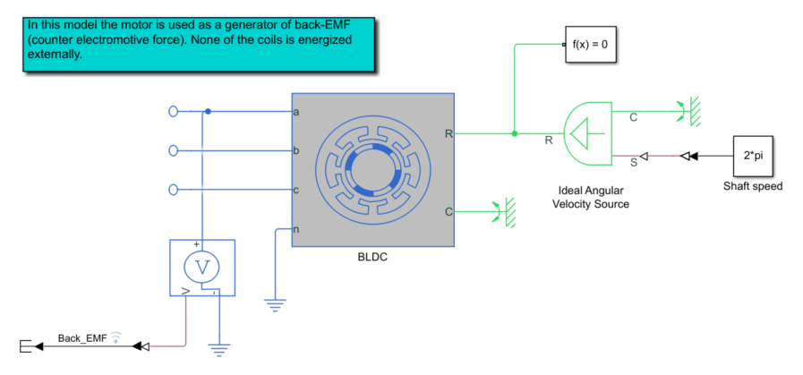

# Simulink implementation simulating the Back-EMF Voltage of a BLDC Motor

## 🛠 Model and Setup

The provided model shown below lets you simulate a three-phase BLDC motor and observe its back-EMF voltage.

|  |
| :---------------: |

In this simulation, we created a scenario where we turn the motor shaft at constant speed while having open terminals at all three phases and then measure the voltage produced at one of the phases to observe the back-EMF which is shown in the below picture.

A type of similarly structured motor is the permanent magnet synchronous machine, or PMSM.
In a second step, we tried to replace the BLDC motor which produces a trapezoidal back-EMF with a PMSM motor which generates a sinusoidal back-EMF. Note that a different type of control algorithm is required to operate these motors (**Field Oriented Control - FOC**).
The back-EMF of the PMSM motor is shown in the below picture.

