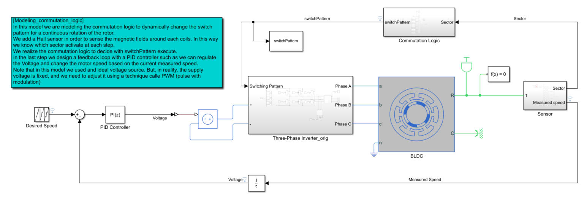
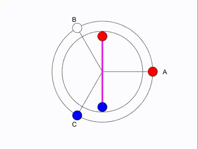

# Introducing the Commutation Logic

## 🛠 Model and Setup

In this model we are modeling the commutation logic to dynamically change the switch pattern for a continuous rotation of the rotor.

|  |
| :---------------: |

## What is new
1. We added a Hall sensor in order to sense the magnetic fields around each coils. In this way we know which sector activate at each step.

2. We realized the commutation logic to decide with switchPattern execute.

3. We designed a feedback loop with a PID controller so that we can regulate the Voltage and change the motor speed based on the current measured speed.

__Note__: that in this model we used and ideal voltage source. But, in reality, the supply voltage is fixed, and we need to adjust it using a technique called PWM (pulse with modulation).

| CONSTANT SPEED           | VARIABLE SPEED         |
| :--------------:         | :--------:             |
|  |  |

## Usage

You can do the following with the provided files:

- Run Simulink model (simple_speed_control_pt3.slx) and open up the Data Inspector to view the logged signals such the desired and measured speeds and supplied voltage to the three-phase inverter.

- Run MATLAB file `animateRotorPosition_3.m` to create the BLDC motor animation. After running the MATLAB file, the animation after 3 seconds. The MATLAB file runs the Simulink model, and uses the simulated data to animate the BLDC motor.
