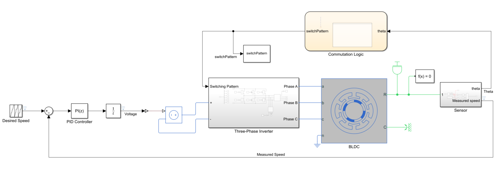
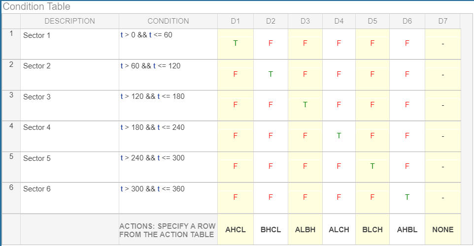
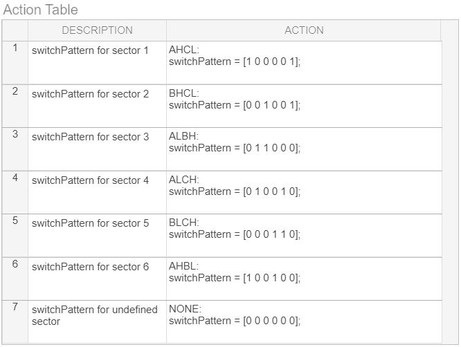

# Introducing the Commutation Logic using Stateflow

## 🛠 Model and Setup

In this model we are modeling the commutation logic to dynamically change the switch pattern for a continuous rotation of the rotor.

|  |
| :---------------: |

In this model we are modeling the commutation logic using a Truth-Table within a Stateflow chart.

## What is changed from the previous version?

1. Removed che commutation logic that use the multi-port switch circuit.
3. Removed the logic circuit that calculate the sector based on the angle degrees
2. Realized the commutation logic using a Truth-Table within a Stateflow chart.

__Note__: In this model we used and ideal voltage source. But, in reality, the supply voltage is fixed, and we need to adjust it using a technique called PWM (pulse with modulation).

## Stateflow chart
Dividing a complete motor rotation in 6 sectors, we obtain 6 different angles of 60 degrees each one. For each this angles exists a  function that output the desired switch pattern.
The following Truth-Table take the angle as an input and return the right pattern switch for Three-Phase Inverter.

|  | 
| :----------------------:        |
|     |

## Usage

You can do the following with the provided files:

- Run Simulink model (Modeling_commutation_logic.slx) and open up the Data Inspector to view the logged signals such the desired and measured speeds and supplied voltage to the three-phase inverter.

- Run MATLAB file `animateRotorPosition_stateflow` to create the BLDC motor animation. After running the MATLAB file, the animation after 3 seconds. The MATLAB file runs the Simulink model, and uses the simulated data to animate the BLDC motor.
