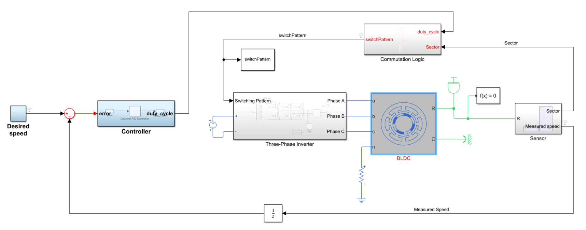
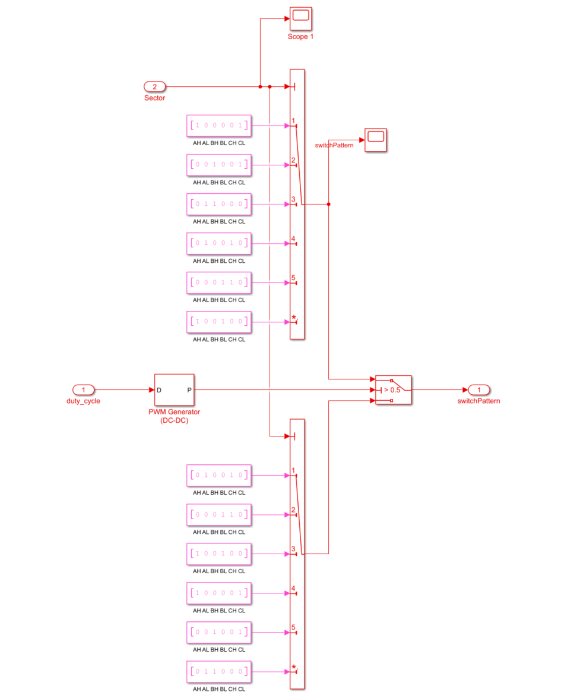

# Introducing the PWM Control of a BLDC motor 

## 🛠 Model and Setup

In the Simulink model which is shown in the following snapshot, the three-phase voltages are modulated directly using PWM that is implemented under the commutation logic subsystem.

|  |
| :---------------: |

## What's new?!
1. Added a PWM generator which take the duty cycle as an input and output a pulse that performs a switch between the 2 commutation logics.

⚠ Many configuration parameters of the model has been changed respect to the others implementations.

|  |
| :---------------: |

## Usage

You can do the following with the provided files:

- Run Simulink model (simple_speed_control_pt4.slx) and open up the Data Inspector to view the logged signals such the desired and measured speeds and supplied voltage to the three-phase inverter.
